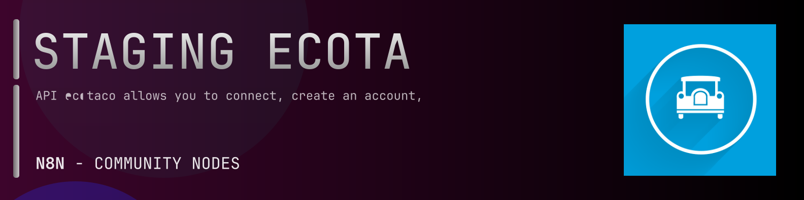

# @n8n-dev/n8n-nodes-staging-ecotaco



[](https://www.npmjs.com/package/@n8n-dev/n8n-nodes-staging-ecotaco)
[](https://opensource.org/licenses/MIT)

---

**Stop writing staging-ecotaco API integrations by hand.**

Every time you connect n8n to staging-ecotaco, you waste hours mapping endpoints, defining parameters, and debugging schemas. You copy-paste from docs, fix edge cases, and pray nothing breaks.

**What if connecting n8n to staging-ecotaco took 5 minutes, not half a day?**

This node gives you **8+ resources** out of the box: **Eco Ta Co API Root**, **Accounts**, **Credit Cards**, **Rides**, **Promotional Codes**, and 3 more: with full CRUD operations, typed parameters, and zero manual configuration.

---

## What You Get

- **Zero boilerplate**: Resources, operations, and fields are pre-configured and ready to use
- **Full CRUD**: Create, read, update, and delete support where the API allows it
- **Typed parameters**: No more guessing field types
- **Built-in auth**: API key authentication, ready to go
- **Declarative**: Native n8n performance, no custom execute() overhead

---

## Install

```bash
npm install @n8n-dev/n8n-nodes-staging-ecotaco
```

**Or in n8n:**
1. **Settings → Community Nodes → Install**
2. Search: `@n8n-dev/n8n-nodes-staging-ecotaco`
3. Click **Install**

---

## Quick Start

1. Install the node (above)
2. Add credentials: **staging-ecotaco API** → paste your API key
3. Drag the **staging-ecotaco** node into your workflow
4. Pick a resource → pick an operation → done.

That's it. No configuration files. No code. It just works.

---

## Resources

| Resource | Operations |
|----------|------------|
| Eco Ta Co API Root | GET Retrieve the version API, GET Retrieve the Entry Point on Version |
| Accounts | GET Get current user, POST Create a new account with an application key, PUT Update User, POST Forget password with email, GET Payment Methods, POST Settings, POST Login with email, password and application key, PUT Update Password |
| Credit Cards | GET List all CreditCards for the current User, GET Get a CreditCard |
| Rides | GET Get a ride, GET Cancel a Ride, GET Cancel fee of a Ride, GET Estimate a ride, POST Reserve a ride, GET Get all user rides, POST Create a ride |
| Promotional Codes | GET Get all promotional codes for user, POST Add a promotional code |
| Adresses | POST Get autocomplete places, POST Get autocomplete places details |
| Catchement Areas | GET List all catchement areas, GET Get a Catchement Area |
| Products | GET List all products, GET Get a Product |

---

## Why This Node?

**Without this node:**
- Hours of manual API integration
- Copy-pasting from staging-ecotaco docs
- Debugging auth, pagination, error handling
- Maintaining your own client code

**With this node:**
- Install → configure → use. 5 minutes.
- Auto-generated from the official staging-ecotaco OpenAPI spec
- Always up to date when the API changes
- Native n8n performance

---

## Auto-Generated
This node was auto-generated from the official **staging-ecotaco** OpenAPI specification using
[@n8n-dev/n8n-openapi-node-ultimate](https://github.com/kelvinzer0/n8n-openapi-node-ultimate),
then validated against the live API so you get accurate types and real parameters, not guesswork.

When the staging-ecotaco API updates, this node updates too.

---

## Support This Project

If this node saved you hours of work, consider supporting continued development, new APIs, better error handling, and faster updates.

[](https://n8n-code.github.io/membership/#/eyJ0aXRsZSI6IktlZXAgSXQgTW92aW5nIiwiZGVzYyI6Ik9uZSBkZXZlbG9wZXIgYnVpbHQgYSB0b29sIHRoYXQgYXV0by1nZW5lcmF0ZXNcbm44biBub2RlcyBmcm9tIGFueSBPcGVuQVBJIHNwZWMuXG5cbllvdXIgZG9uYXRpb24gZnVuZHMgbmV3IGZlYXR1cmVzLCBtb3JlIEFQSSBzdXBwb3J0LFxuYW5kIGJldHRlciB0b29saW5nIGZvciBldmVyeSBkZXZlbG9wZXIgYWZ0ZXIgeW91LiIsInRhcmdldCI6NTAwMCwiYWRkcmVzc2VzIjp7ImV0aGVyZXVtIjoiMHhmMDU1NWQ0MGRiRkI0ZTNCZjA3MDQ0MjgyQjc4RjJmRTFmNTFFZjcyIiwic29sYW5hIjoiNlpEVk5BYmpZZExEcXo4cGt3VUNHYllaNVV3QlFranB0QzU1Wk5vTFcybVUifSwiZGlzY29yZCI6Imh0dHBzOi8vZGlzY29yZC5nZy9wdERaOGU0aDkzIn0)

---

## License

MIT © [kelvinzer0](https://github.com/n8n-code)
